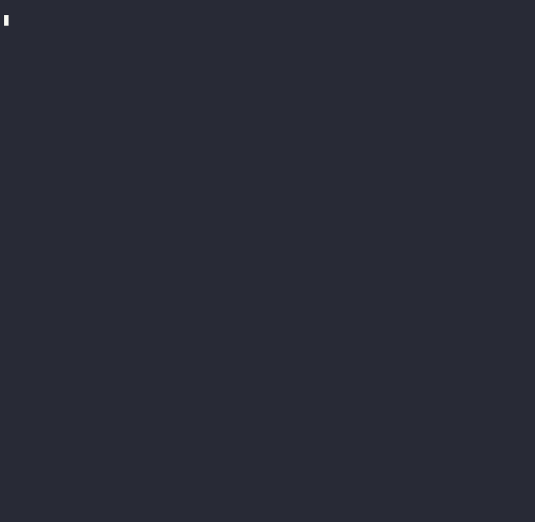

<p align="center">
  
  
  
  
  
  
</p>

# SignaWORKS

**A systematic options income toolkit. Precision, not gambling.**

You're selling insurance on assets you actually want to own, using a statistical edge that has nothing to do with guessing direction. Every trade survives six independent gates before it reaches your eyes. What you do with it is your decision. The toolkit only surfaces what's worth looking at.

<p align="center">
  
  <br>
  <sub><i>Live scan: 21 actionable setups from a 48-ticker universe. Dracula theme courtesy of asciinema + agg.</i></sub>
</p>

---

## Philosophy

Most options trading is directional gambling dressed up as strategy. SignaWORKS starts from a different place: **only sell puts on stocks you'd be comfortable owning at the strike for 12 months.** If the name doesn't pass that test, it never enters the universe.

From there, the toolkit applies layered filters:

- **Gate 1:** IV Rank ≥ 50% — sell premium when vol is elevated relative to its own 52-week history. Statistical edge from mean reversion.
- **Gate 2:** IV > HV — options are pricing more movement than the stock is actually making. You're getting paid for vol risk that exceeds realized vol.
- **Gate 3:** Price above 200MA — bearish trend breaks the thesis. Below 200MA means assignment risk just jumped.
- **Gate 4:** Delta ≤ 0.10 — a ~90% probability the put expires worthless, computed via Black-Scholes, not yfinance's approximation.
- **Gate 5:** Premium display — absolute dollars and return on notional. No hard floor beyond $75 (commissions eat thinner trades).
- **Gate 6 (soft):** IV direction — declining vol is the optimal entry window. Rising vol means wait or watch.

**48 tickers. 6 gates. 21 actionable. No opinions, no gut feels, no "I think the market is going to..."**

---

## Live Demo

Run the offline demo (no API keys needed):

```bash
python3 demo/demo.py         # Full scan with results table
python3 demo/demo.py --quick # Single-ticker walkthrough (TSM)
```

**What you'll see — real output from June 27 scan:**

### Actionable Setups (21 of 48 tickers)

| Ticker | Price | Strike | Prem | Prem% | DTE | IVR | IV/HV | IVΔ5d | MA | OI | β | Status |
|--------|-------|--------|------|-------|-----|-----|-------|-------|----|----|----|--------|
| TSM | $432.35 | 340P | $482 | 1.42% | 55d | 81% | +9.0 | ↓0.8% | 🟢 | 3152 | 1.4 | **READY** |
| JNJ | $254.66 | 220P | $113 | 0.51% | 55d | 71% | +5.8 | ↓0.5% | 🟢 | 972 | 0.3 | **READY** |
| GE | $369.00 | 300P | $276 | 0.92% | 55d | 51% | +4.5 | ↓1.2% | 🟢 | 579 | 1.4 | **READY** |
| AMD | $521.58 | 370P | $948 | 2.56% | 55d | 98% | +18.6 | ↑5.7% | 🟢 | 2704 | 3.0 | **WATCH** |
| AMAT | $626.84 | 430P | $1155 | 2.69% | 55d | 106% | +10.3 | ↑3.3% | 🟢 | 307 | 1.7 | **WATCH** |
| LRCX | $379.09 | 260P | $718 | 2.76% | 55d | 103% | +8.0 | ↑3.1% | 🟢 | 686 | 1.9 | **WATCH** |
| QQQ | $706.52 | 600P | $512 | 0.85% | 55d | 81% | +6.2 | ↑5.4% | 🟢 | 8085 | 1.2 | **WATCH** |
| LLY | $1208.12 | 980P | $898 | 0.92% | 55d | 61% | +14.1 | ↑1.2% | 🟢 | 296 | 0.5 | **WATCH** |
| SMH | $611.61 | 460P | $852 | 1.85% | 55d | 96% | +5.0 | ↑1.7% | 🟢 | 5166 | 1.7 | **WATCH** |
| AAPL | $283.78 | 240P | $178 | 0.74% | 55d | 72% | +15.9 | ↑1.1% | 🟡 | 7258 | 1.1 | **WATCH_AMBER** |
| ... | ... | ... | ... | ... | ... | ... | ... | ... | ... | ... | ... | ... |

### Gate Failures (selected)

| Ticker | Gate | Reason |
|--------|------|--------|
| MU | FAIL_G2 | IV-HV=-9.7 — realized vol exceeds implied (no premium edge) |
| MSFT | FAIL_G3 | Price below 200MA — broken trend |
| META | FAIL_G3 | Price below 200MA |
| NVDA | FAIL_G1 | IVR=22% — no vol opportunity here |
| BLK | SKIP | Liquidity=1 — spreads too wide |

**Status codes:** READY = all gates pass + IV declining (optimal) · WATCH = all gates pass + IV still rising (may improve) · _AMBER = price below 50MA (caution) · FAIL_GX = which gate rejected it

DTE strategy: **45 DTE entry → 50% profit or 21 DTE exit** (whichever first).

---

## Architecture

```
                        ┌──────────────────────────┐
                        │     csp_universe.json     │
                        │  48 quality tickers,      │
                        │  8 sectors, 5 ETFs        │
                        └────────────┬─────────────┘
                                     │
                    ┌────────────────┴────────────────┐
                    │                                  │
                    ▼                                  ▼
     ┌──────────────────────────┐      ┌──────────────────────────┐
     │    csp_discovery.py      │      │     csp_scanner.py       │
     │    Weekly Pre-Screen     │      │     On-Demand 6-Gate     │
     │                          │      │                          │
     │  • Tastytrade API        │      │  • Tastytrade (G1,G2)    │
     │  • Liquidity ≥ 2         │      │  • yfinance (G3, price)   │
     │  • IVR ≥ 50%             │      │  • Black-Scholes (G4)    │
     │  • IV/HV > 0             │      │  • Premium display (G5)  │
     │                          │      │  • IV direction (G6)     │
     └───────────┬──────────────┘      └───────────┬──────────────┘
                 │                                  │
                 ▼                                  ▼
     ┌──────────────────────────┐      ┌──────────────────────────┐
     │   csp_candidates.json    │      │    Markdown Table        │
     │   Surviving tickers      │─────▶│    + JSON Output         │
     │   for detailed scan      │      │                          │
     └──────────────────────────┘      └──────────────────────────┘
                                                  │
                                                  ▼
                                     ┌──────────────────────────┐
                                     │   position_monitor.py    │
                                     │   Post-Entry Management  │
                                     │                          │
                                     │  • Layer 1: Price > 50MA │
                                     │  • Layer 2: P/L + IVR    │
                                     │  • Layer 3: Material news│
                                     └──────────────────────────┘
                                                  │
                                                  ▼
                                     ┌──────────────────────────┐
                                     │   position_review.py     │
                                     │   Weekly Greek Review    │
                                     │                          │
                                     │  • Delta, Gamma, Vega, Θ │
                                     │  • GEX regime analysis   │
                                     │  • Forward earnings scan │
                                     └──────────────────────────┘
```

**Three-phase workflow:** Pre-entry screening → Entry execution (your decision) → Post-entry monitoring and exit management.

---

## Project Structure

```
SignaWORKS/
├── scanner/
│   ├── csp_scanner.py        # 6-gate entry engine (on-demand)
│   └── csp_discovery.py      # Weekly Tastytrade pre-screening
├── monitors/
│   ├── position_monitor.py   # 3-layer trigger system (post-entry)
│   └── position_news.py      # Material news filter
├── review/
│   └── position_review.py    # Weekly Greeks + GEX review
├── demo/
│   └── demo.py               # Offline walkthrough (no API keys)
├── docs/
│   ├── entry-scanner-framework.md
│   ├── position-review-framework.md
│   └── volatility-framework.md
├── data/
│   └── csp_universe.json     # Curated ticker universe
├── .env.example              # Environment variable template
├── .gitignore
├── requirements.txt
└── README.md
```

---

## Quick Start

### 1. Clone

```bash
git clone https://github.com/limchinhan123/SignaWORKS.git
cd SignaWORKS
```

### 2. Install

```bash
python3 -m venv .venv
source .venv/bin/activate
pip install -r requirements.txt
```

### 3. Configure

```bash
cp .env.example .env
```

Edit `.env` with your credentials:

```bash
TASTYTRADE_CLIENT_SECRET=your_client_secret
TASTYTRADE_REFRESH_TOKEN=your_refresh_token
NEWS_TICKERS_CONFIG=/path/to/news_config.json
GOOGLE_SHEET_ID=your_sheet_id
```

**Never commit `.env`** — it's in `.gitignore`.

### 4. Run

```bash
# Offline demo (no API keys)
python3 demo/demo.py

# Weekly pre-screening (filter universe through Tastytrade gates)
python3 scanner/csp_discovery.py

# Full 6-gate scan on surviving candidates
python3 scanner/csp_scanner.py --file data/csp_candidates.json

# Scan specific tickers
python3 scanner/csp_scanner.py --tickers AAPL MSFT QQQ --format md
```

---

## The Six Gates in Detail

### Gate 1: IV Rank ≥ 50%
**Why:** Selling premium when IV is in the top half of its 52-week range gives mean-reversion tailwind. Vol tends to revert. Selling high vol, buying it back lower is the edge.
**Fails when:** The market is calm. Good for the portfolio, bad for premium.

### Gate 2: IV > HV
**Why:** When options are pricing more movement than the stock is actually making, you're selling insurance at a markup. Tastytrade precomputes this as IV30d minus HV30d.
**Fails when:** Realized vol spikes above implied (MU on June 27: IVR=80% but HV was faster). The gate says "the market decayed before you could sell into it." Listen to it.

### Gate 3: Price > 200MA
**Why:** Below the 200-day moving average means the trend is broken. Assignment risk is asymmetric: a stock in a downtrend is more likely to keep dropping. Also checks 50MA for a tiered signal (green/amber).
**Fails when:** MSFT $373 < 200MA $448. Even Microsoft in a downtrend isn't a CSP you want.

### Gate 4: Delta ≤ 0.10
**Why:** ~90% probability the put expires worthless, assuming Black-Scholes assumptions hold. SignaWORKS computes this from the option's own implied volatility (a circular but standard approach), not yfinance's approximation.
**Fails when:** No strike in the 30-55 DTE range reaches 0.10 delta. The stock is too volatile or the chain doesn't go far enough OTM.

### Gate 5: Premium Display
**Why:** Absolute dollars and return on notional, side by side. No hard threshold beyond $75 (commissions). Sometimes 0.5% on JNJ with IV declining is better than 2.5% on AMD with IV still surging. You decide.
**Displays:** `$482 (1.42%)` — you're earning 1.42% on the notional risked for a 45-day hold.

### Gate 6: IV Direction (Soft)
**Why:** Context, not a gate. Declining vol means the spike is receding — optimal entry. Rising vol means the spike is still building — premium will get richer but the underlying might be under stress.
**READY** vs **WATCH**: declining IV = READY, rising IV = WATCH.

---

## Dependencies

| Package | Purpose |
|---------|---------|
| `tastytrade` | IV Rank, IV percentile, IV30d, HV30d, liquidity, beta |
| `yfinance` | Price, 50/200 MA, option chains (free, delayed) |
| `scipy` | Black-Scholes delta calculation (norm.cdf) |
| `numpy` | Numerical operations for options math |

No paid APIs. Tastytrade is free with a funded account. yfinance is free with Yahoo Finance.

---

## FAQ

**Why no trade execution?**
This is a decision-support toolkit, not a black box. Every trade is yours to size and enter. The tools surface what's statistically worth looking at. You bring the conviction.

**What if the market is calm (low IVR)?**
Then the scanner returns mostly FAIL_G1. That's the point. You don't force trades into low-vol environments. Patience is a position.

**How does this compare to tastytrade's built-in screener?**
Tastytrade's screener is broader. SignaWORKS adds Black-Scholes delta from yfinance chains (independent of Tastytrade's pricing), tiered MA analysis, and the ownership-first universe filter. It also integrates post-entry monitoring and weekly Greek reviews in one pipeline.

**Can I add my own tickers?**
Edit `data/csp_universe.json`, add the symbol, ensure it passes the ownership test. Next scan picks it up.

**Weekend vs weekday data?**
Tastytrade returns Friday close data on weekends. The scanner works, but expiry dates shift. Monday morning shows fresh 45 DTE matches.

---

## License

MIT — use it, modify it, trade with it. If it makes you money, buy your spouse something nice.

---

<p align="center">
  <sub>Built entirely by <a href="https://github.com/nousresearch/hermes-agent">Hermes Agent</a> on <strong>DeepSeek 4.0 Pro</strong>. Zero human code written. Every gate, every line of Black-Scholes, every script came from a conversation between Brandon and his Q.</sub>
</p>
